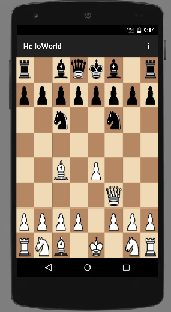

# Funkcionális specifikáció
## 1. Jelenlegi helyzet leírása

Jelenleg nincs elegendő, jól kidolgozott sakkjáték Android platformra, amely könnyen elérhető és offline módon is működik. A legtöbb elérhető sakkalkalmazás internetkapcsolatot igényel, és gyakran tele van reklámokkal, ami zavarhatja a felhasználói élményt.

## 2. Vágyálomrendszer leírása

A cél egy Kotlinban megírt, Android Studio-ban fejlesztett sakkalkalmazás létrehozása. A játék a klasszikus sakk szabályait követi, és egyértelmű, intuitív kezelőfelülettel rendelkezik. A felhasználó irányításba veszi a fehér és fekete bábukat és lejátszhat egy menetet barátjával vagy ismerősével. A játék grafikus felülete Android eszközökre optimalizált, és támogatja a standard sakk funkciókat, mint a lépésellenőrzés.

## 3. Jelenlegi üzleti folyamatok modellje

Jelenleg a telefonos app store-okban csak olyan sakk játékokat találhatunk amelyek a felhasználó számára túl bonyolultnak tűnnek.
Ezek nagy része reklámokat tartalmaz, és internetkapcsolatot igényel, ami csökkentheti a felhasználói élményt és megnehezíti a minőségi játék megtalálását. Ezen kívül ezek az alkalmazások gyakran változó minőségűek, és nem mindig biztosítanak stabil offline módot.

## 4. Igényelt üzleti folyamatok modellje

A felhasználó az alkalmazás megnyitása után bármikor offline módban indíthatja el a játékot, és addig játszhat, ameddig szeretne, internetkapcsolat nélkül, így biztosítva a szórakoztató felhasználói élményt.

## 5. Követelménylista

| Id | Modul | Név | Leírás |
| K1 | Játék | Tábla megjelenítése | A játékos lát egy 8x8-as sakk táblát a képernyőn, amelyen a bábuk kezdő pozícióban vannak. |
| K2 | Játék | Bábuk mozgatása | A játékos kiválaszthat egy bábut, és a sakk szabályai szerint léphet vele. |
| K3 | Játék | Lépések ellenőrzése | A rendszer ellenőrzi, hogy a játékos által kiválasztott lépés szabályos-e.|
| K4 | Játék | Sakk és Matt ellenőrzés | A rendszer folyamatosan ellenőrzi, hogy sakk vagy matt helyzet alakult-e ki. |
| K5 | Játék | Emberi ellenfél | A játékos játszhat egy másik emberi játékos ellen, akik ugyanazon az eszközön felváltva lépnek. |
| K6 | Játék | Eredmény tárolása | A játék végén a rendszer elmenti a játék eredményét egy adatbázisba, amely tartalmazza a győztest és a lépések számát. |
| K7 | Játék | Start menü | A játék indításakor egy egyszerű start menü jelenik meg, amely lehetőséget ad új játék indítására vagy kilépésre. |
| K8 | Játék vége képernyő | A játék végén megjelenik egy egyszerű képernyő, amely mutatja a győztest és lehetőséget ad új játék indítására vagy kilépésre. |

## 6. Használati esetek

A felhasználó egy egyszerűen kezelhető és jól áttekinthető Android alkalmazás segítségével sakkozhat offline módban. Az alkalmazás lehetővé teszi, hogy a felhasználó sakkot játszahasson barátai ellen majd az eredményt megtekinthetjük a képernyőre kiírva.

## 7. Megfeleltetés, hogyan fedik le a használati eseteket a követelményeket

A felhasználó a sakkfigurák mozgatásával lépéseket tehet a táblán, amelyet a rendszer validál a sakk szabályainak megfelelően. A játék sakk-matt vagy döntetlen esetében ér véget majd kiírja az eredményt.

## 8. Képernyőtervek

## 10. Funkció - követelmény megfeleltetése

K1: Az alkalmazás elindításakor a képernyőn megjelenik a 8x8-as sakktábla, amelyen a bábuk a kezdő pozícióban vannak, ezzel biztosítva a játékos számára a játék kezdőállását.
K2: A játékos a bábukra kattintva kiválaszthat egy bábut, amelyet a sakk szabályai szerint mozgathat. Az alkalmazás biztosítja, hogy csak érvényes lépéseket lehessen végrehajtani.
K3: Minden lépés után a rendszer ellenőrzi a lépés érvényességét, és csak a szabályos lépéseket engedi végrehajtani. Ezzel elkerülhetők a szabálytalan lépések.
K4: A játék során a rendszer automatikusan és folyamatosan figyeli a sakk és matt helyzeteket, ezzel biztosítva, hogy a játék mindig az aktuális helyzetnek megfelelően folytatódjon vagy fejeződjön be.
K5: Az alkalmazás lehetőséget biztosít két játékos számára, hogy ugyanazon az eszközön felváltva léphessenek, így emberi ellenfél ellen is játszható a játék.
K6: A játék végén az alkalmazás elmenti az eredményt egy adatbázisba, amely tartalmazza a győztest és a lépések számát, így a játékosok visszanézhetik a korábbi játszmák eredményeit.
K7: Az alkalmazás megnyitásakor egy start menü jelenik meg, amely lehetőséget biztosít új játék indítására vagy a programból való kilépésre.
K8: A játék végén egy képernyő jelenik meg, amely megmutatja a győztest, és lehetőséget ad új játék indítására vagy a kilépésre, ezzel biztosítva a játékos számára a továbblépést vagy a játék befejezését.

## 11 Fogalomszótár

